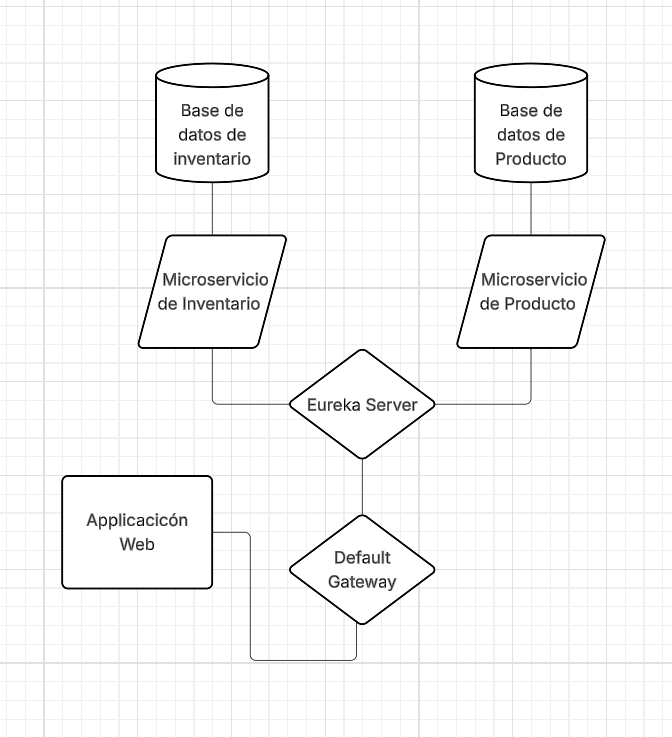

# Sistema de Gestion de Inventario
# Product and Inventory System (Microservices)

Este proyecto es una arquitectura de microservicios diseñada para gestionar el inventario y catálogo de productos de forma escalable.

## 🏗️ Arquitectura del Sistema

El sistema se compone de los siguientes módulos:

* **API Gateway:** Punto de entrada único para las peticiones. Se encarga del enrutamiento y la seguridad.
* **Eureka Server:** Service Discovery que permite que los microservicios se encuentren entre sí dinámicamente.
* **Product Microservice:** Gestión del catálogo, precios y detalles de productos.
* **Inventory Microservice:** Control de stock y disponibilidad en tiempo real.

## 🛠️ Tecnologías Utilizadas

| Componente | Tecnología |
| :--- | :--- |
| **Backend** | Java 17+, Spring Boot 3.x |
| **Microservicios** | Spring Cloud (Eureka, Gateway) |
| **Base de Datos** | PostgreSQL / MySQL (una por servicio) |
| **Comunicación** | REST / OpenFeign |

## 🚀 Cómo ejecutar localmente

1. Levantar **Eureka Server** (Puerto 8761).
2. Levantar los microservicios de **Producto e Inventario**.
3. Levantar el **API Gateway**.
4. Acceder a través del Gateway (ej: `http://localhost:8080/api/v01/products/1`).

## 🖇️ Endpoints Principales (Gateway)
* `GET /api/v01/products/{id}` - Obtener detalle de producto.
* `GET /api/v01/inventory/{id}` - Consultar stock.
* 